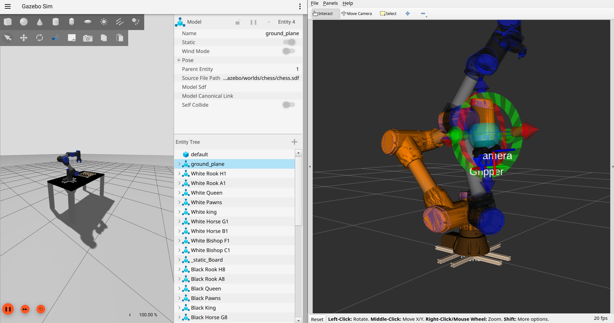

# Quickstart


## Simulation (linux required)

### 1.1 Clone the simulation repository

```bash
cd /ros2_ws/src
git clone https://github.com/C-O-R-A/cora_desktop.git \
colcon build --symlink-install
```

### 1.2 Install codi

```bash
cd ../codi
git clone https://github.com/C-O-R-A/CoDI.git
pip install git+https://github.com/C-O-R-A/CoDI.git
```

### 2. Start the simulation

In terminal 1

```bash
ros2 launch cora_gazebo gazebo.launch.py
```

:::{tip} Expected result
Gazebo opens with your configured arm. RViz2 shows the robot model with
MoveIt 2 loaded. You can send joint goals from the Motion Planning panel.
:::



### 3. Run an example

In terminal 2

```bash
python3 examples/teleop_keyboard.py
```

### 4. Control with teleop

Control the arm with the following schema

| button | Original design |
| --- | --- |
| w | forward (+x) |
| a | left (-y) |
| x | backwards (-x) |
| d | right (+y) |
| s | switch control modes |


